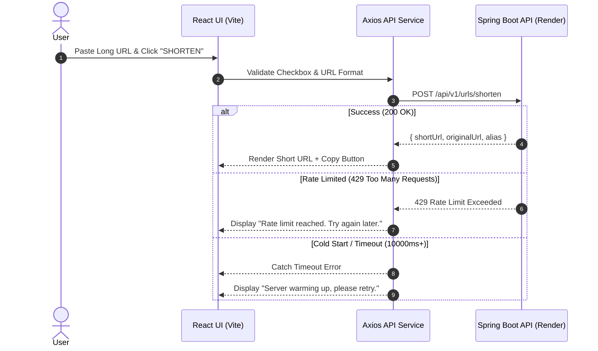

<div align="center">

# ⚡ ZIPLINK.IO — Frontend

**Swiss Precision URL Shortener UI**

[](https://vitejs.dev/)
[](https://react.dev/)
[](https://tailwindcss.com/)
[](https://lucide.dev/)
[](https://vercel.com/)

An ultra-clean, modern, minimalist single-page web interface for **ZIPLINK.IO**, built using React, Vite, and Tailwind CSS. Designed with high precision, sleek dark-mode aesthetics, responsive ergonomics, and seamless API error handling.

[Live Demo](https://ziplink-indol.vercel.app) • [Backend Repository](https://github.com/InzmamKhan/Ziplink_Backend)

</div>

---

## 🎨 Key Features

- **Minimalist Swiss Precision UI:** Clean monochrome aesthetic engineered with Tailwind CSS.
- **Instant URL Shortening:** Sub-second link generation powered by Axios and asynchronous React hooks.
- **One-Click Copy:** Seamless interaction allowing users to instantly copy generated short links to their clipboard.
- **Terms of Service Checkbox Safeguard:** Form validation enforcing user compliance before URL shortening.
- **Graceful Error Handling:** Dynamic toast and banner alerts for invalid URLs, rate limiting (HTTP 429), server cold-start delays, and timeouts.
- **Fully Responsive Ergonomics:** Optimized for mobile screens, tablets, ultra-wide desktop monitors, and dark mode environments.

---

## 🛠️ Tech Stack

- **Framework:** [React 18](https://react.dev/)
- **Build Tool:** [Vite](https://vitejs.dev/)
- **Styling:** [Tailwind CSS](https://tailwindcss.com/)
- **Icons:** [Lucide React](https://lucide.dev/)
- **HTTP Client:** [Axios](https://axios-http.com/)
- **Deployment Platform:** [Vercel](https://vercel.com/)

---

## 📁 Folder Structure

```text
ziplink-frontend/
├── public/
│   └── favicon.ico
├── src/
│   ├── assets/          # Static branding assets and images
│   ├── components/      # Modular UI components (ShortenerForm, Navbar, Footer, Modal)
│   ├── services/        # Axios API client configurations and interceptors
│   ├── App.jsx          # Main application layout and state management
│   ├── main.jsx         # Application entry point and DOM root renderer
│   └── index.css        # Global styles and Tailwind directives
├── .env.example         # Template for environment variables
├── index.html           # Main HTML document template
├── package.json         # Dependencies, scripts, and package metadata
├── tailwind.config.js   # Tailwind custom theme definitions
└── vite.config.js       # Vite configuration and server settings
```

---

## 🚀 Getting Started

Follow these instructions to set up and run the frontend application locally on your machine.

### Prerequisites

Ensure you have the following installed:
- **Node.js**: `v18.0.0` or higher
- **npm**: `v9.0.0` or higher (or `pnpm` / `yarn`)

### Installation & Local Setup

1. **Clone the repository:**
   ```bash
   git clone https://github.com/InzmamKhan/Ziplink_Frontend.git
   cd Ziplink_Frontend
   ```

2. **Install dependencies:**
   ```bash
   npm install
   ```

3. **Configure Environment Variables:**
   Create a `.env` file in the root directory by duplicating `.env.example`:
   ```bash
   cp .env.example .env
   ```

   Add your backend URL target to `.env`:
   ```env
   VITE_API_BASE_URL=http://localhost:8080
   ```

4. **Start the local development server:**
   ```bash
   npm run dev
   ```
   Open your browser and navigate to `http://localhost:5173`.

---

## ⚙️ Environment Variables

| Variable Name | Required | Description | Example / Default |
| :--- | :---: | :--- | :--- |
| `VITE_API_BASE_URL` | **Yes** | Base endpoint URL of the Spring Boot Backend Service | `https://ziplink-a3k1.onrender.com` |

> **Note for Production Deployments:** When deploying to platforms like Vercel, assign the `VITE_API_BASE_URL` as a **Config** type environment variable so Vite can compile it into client bundle requests.

---

## 🌐 API Integration Flow



---

## 📦 Scripts Overview

In the project directory, you can run:

- `npm run dev`: Starts the local Vite development server with Hot Module Replacement (HMR).
- `npm run build`: Bundles and optimizes the app for production in the `dist` folder.
- `npm run preview`: Bootstraps a local static web server to preview the built `dist` production output.
- `npm run lint`: Runs ESLint checks across JavaScript and React component files.

---

## 📄 License

Distributed under the MIT License. See `LICENSE` for more information.